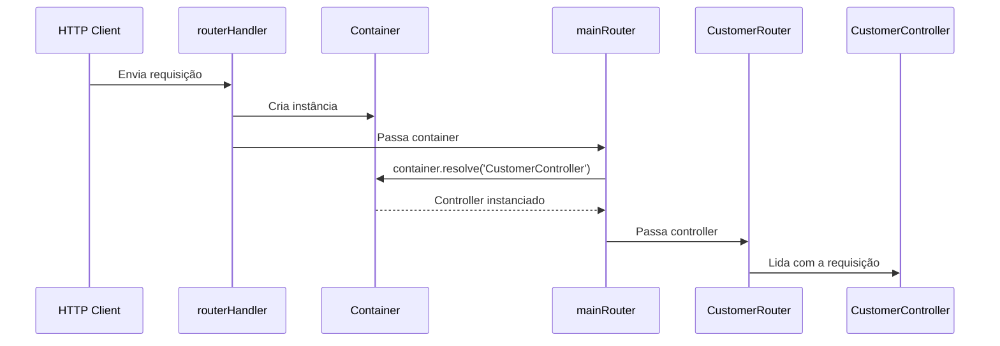

# Node.js HTTP Server

Projeto de exemplo utilizando **Node.js puro com TypeScript**, sem frameworks, com foco em **boas práticas**, **qualidade mínima necessária** e **entendimento profundo da base do backend HTTP**.

Este projeto faz parte da coleção [backend-architecture-evolution](https://github.com/vieira-a/backend-architecture-evolution), que explora a evolução arquitetural de aplicações backend.

---

## Objetivo

Demonstrar que é possível escrever **código limpo, testável e organizado** mesmo sem utilizar frameworks — neste caso, usando apenas o módulo nativo `http` do Node.js.

---

## Aplicação de exemplo

A aplicação implementa uma API simples com os seguintes recursos:

- **Customer**
  - Criar clientes com nome e e-mail
- **Order**
  - Criar pedidos associados a um cliente existente (via `customerId`)

Essa estrutura foi escolhida para exemplificar uma situação em que **um serviço depende de outro**, o que exige que haja comunicação e validação entre eles. Por exemplo:

- O `OrderService` depende do `CustomerService` para verificar se o cliente existe antes de registrar um pedido.
- Isso nos permite ilustrar **como lidar com dependências entre camadas**, mesmo sem um framework que injete automaticamente esses serviços.

---

## 📦 Tecnologias utilizadas

- Node.js (módulo `http`)
- TypeScript
- PostgreSQL (com driver `pg`)
- Zod (validação de schemas e variáveis de ambiente)
- Jest (testes unitários)
- ESLint + Prettier (padronização de código)
- Husky + Lint-staged (assegurar a execução do linter)

---

## Estrutura do projeto

---

## Destaques

### Roteamento de requisições

1. Roteamento

Em frameworks como Express.js e Nest.js, existem módulos que lidam com o roteamento das requisições. No Express.js temos o Router, onde configuramos os endpoints que serão expostos pela aplicação; já no Nest.js, ao decorar uma classe como `@Controller` e importar dentro de um `@Module`, os endpoints são carregados e expostos automaticamente.

Precisei criar:

- [router-handler.ts](src/router-handler.ts): junto com o [main.ts](src/main.ts), serve como ponto de entrada do servidor, responsável por receber as requisições, capturar e lançar qualquer erro encontrado na entrada.

- [index.router.ts](src/routes/index.router.ts): funciona como um roteador global, responsável por encaminhar as requisições para as rotas das features registradas.

**Ciclo completo de uma requisição**


---

### Injeção de dependências

Frameworks costumam carregar e isponibilizar automaticamente classes e suas dependências por meio de um container de injeção de dependências. No Nest.js por exemplo, ao decorar uma classe como `@Controller` e importá-lo no `@Module`, automaticamente os endpoints desse controller são carregados e disponibilizados pela aplicação. 

Criei o [container.ts](src/dependency-injection/container.ts) com o método `set` para registrar instâncias das classes que serão disponibilizadas pela aplicação, simulando o papel do framework, mas de forma leve e controlada. Com isso, as rotas não sabem como criar o controller, apenas utilizam.

## Executando o projeto localmente

### 1. Clone o repositório

```bash
git clone git@github.com:vieira-a/00-pure-node-http.git
```

### 2. Instale as dependências

```bash
npm install
```

### 3. Configure as variáveis de ambiente

Crie um arquivo .env baseado no .env.example:

```bash
cp .env.example .env
```

Preencha as variáveis de ambiente

### 4. Banco de dados

Caso deseje, poderá subir um container do `Postgres` com o comando abaixo:

```bash
docker compose up -d  
```
Este comando executa o conteúdo do arquivo [docker-compose.yml](docker-compose.yml):

- Cria uma instância do `Postgres` no seu ambiente
- Executar o comando para criar uma nova tabela de acordo com o informado no arquivo `.env``
- Executar o [init.sql](src/database/init.sql) para criar as tabelas `customers` e `orders`, necessárias para a execução das funcionalidades

Caso já tenha uma instância do Postgres instalada na sua máquina, basta criar um novo banco de dados e executar o [init.sql](src/database/init.sql) para criar as tabelas necessárias. 

### 5. Inicialize a aplicação

```bash
npm run dev
```

- A API estará disponível em: http://localhost:3000/api/v1
- Documentação com Swagger: http://localhost:3000/api/v1/docs

### Rotas disponíveis

- GET /health - verifica se o servidor está no ar
- POST /customers - cria um novo Customer
- POST /orders - cria uma nova Order

### 6. Testes unitários e de integração

```bash
npm run test
```

## Trade-offs: simplicidade vs qualidade vs agilidade

Este projeto existe para mostrar que:

- Qualidade não precisa estar ligada a complexidade: mesmo sem framework, é possível aplicar tipagem, validação de dados, organização em camadas, e testes.

- Agilidade vs controle: abrir mão de frameworks como Express ou Nest.js exige mais trabalho inicial, mas permite compreender melhor o ciclo da requisição, além de ter o total controle sobre a aplicação.

- Simplicidade tem valor: em alguns contextos, uma solução simples como essa pode ser mais fácil de manter e escalar do que uma arquitetura complexa demais para o problema.

## Autor

**Anderson Vieira**  
Engenheiro de Software

[LinkedIn](https://www.linkedin.com/in/vieira-a) • [GitHub](https://github.com/vieira-a)

---

## 📄 Licença

MIT © Anderson Vieira
